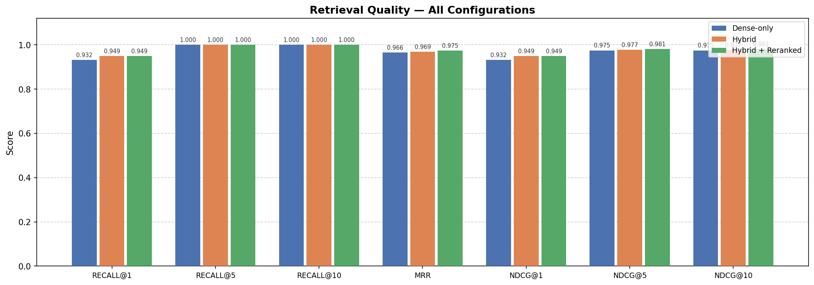
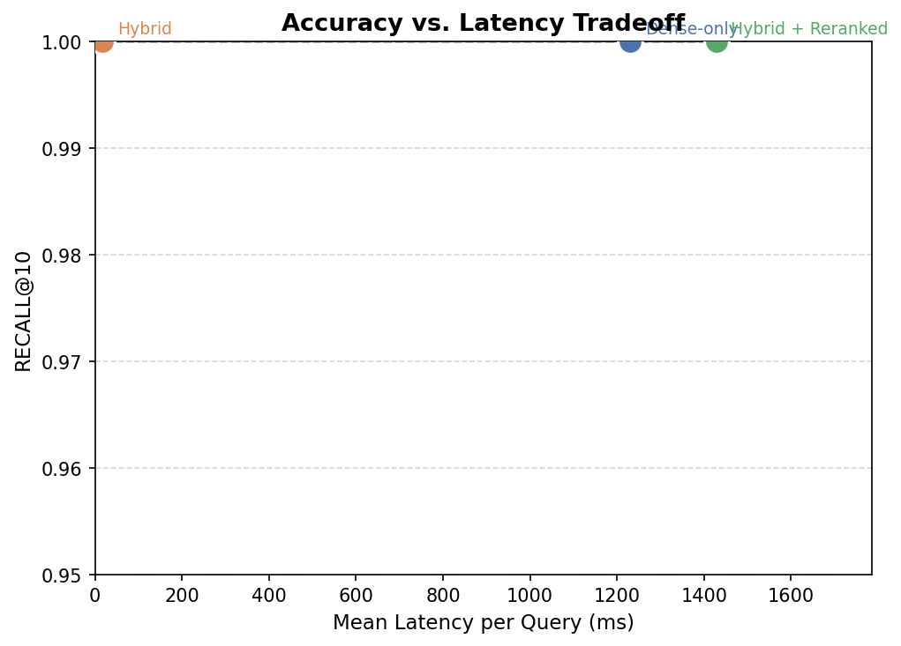
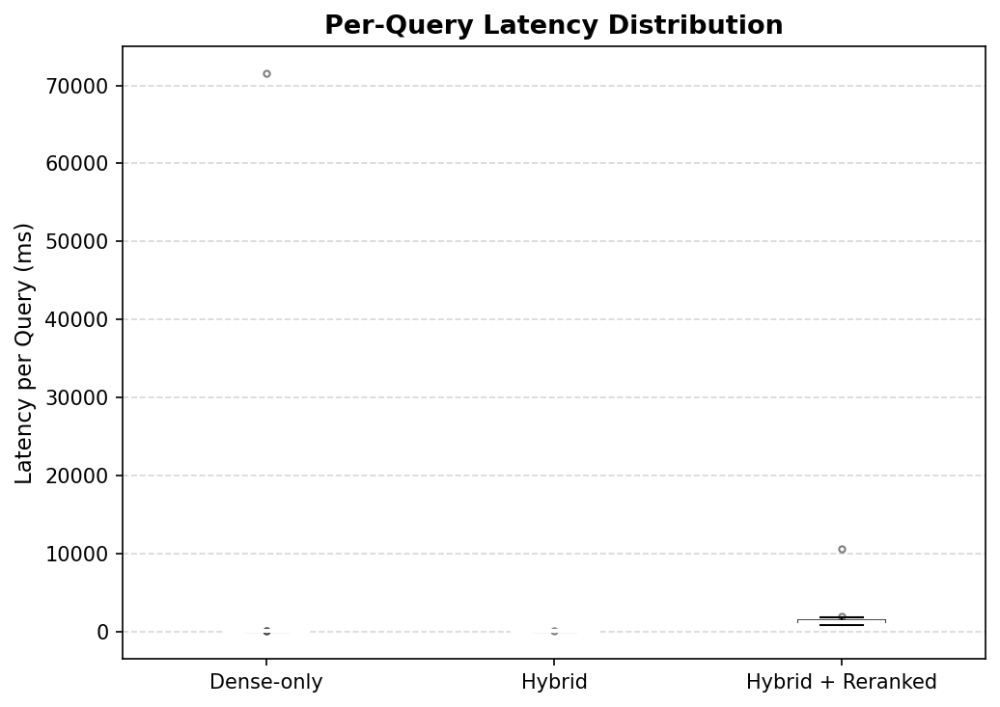

# RetrievalBench

A benchmarking pipeline that tests three retrieval configurations against a labeled query set and measures which one actually retrieves the right information — and what it costs in latency to get there.

Built on top of a clinical/health document corpus modelling the kind of RAG pipeline used in production systems. Every query has a manually labeled ground-truth chunk so results are unambiguous.

---

## The problem it solves

Most RAG pipelines pick a retrieval strategy and assume it works because the system produces fluent answers. RetrievalBench makes retrieval quality measurable: it runs dense search, hybrid search, and cross-encoder reranking side by side and reports standard IR metrics for all three.

---

## Configurations tested

| Configuration | Description |
|---|---|
| **Dense-only** | Bi-encoder cosine similarity over sentence-transformer embeddings |
| **Hybrid** | Linear blend of dense score and BM25 sparse keyword score |
| **Hybrid + Reranked** | Hybrid candidate generation, then cross-encoder rescoring |

---

## Results

*59 queries · 40-chunk corpus · top-k = 10*

### Accuracy

| Configuration | Recall@1 | Recall@3 | Recall@5 | Recall@10 | MRR | nDCG@10 |
|---|---|---|---|---|---|---|
| Dense-only | 0.932 | 1.000 | 1.000 | 1.000 | 0.966 | 0.975 |
| Hybrid | 0.949 | 1.000 | 1.000 | 1.000 | 0.969 | 0.977 |
| Hybrid + Reranked | 0.949 | 1.000 | 1.000 | 1.000 | **0.975** | **0.981** |

### Latency

| Configuration | Mean (ms) | p50 (ms) | p95 (ms) |
|---|---|---|---|
| Dense-only | 18 | 18 | 27 |
| Hybrid | 17 | 18 | 20 |
| Hybrid + Reranked | 1,428 | 1,247 | 1,626 |

### What the numbers say

All three configurations achieve perfect Recall@3 and above — every correct chunk is found within the top 3 results regardless of strategy. The meaningful difference is at Rank 1:

- Dense gets the right chunk to position 1 on **93.2%** of queries
- Hybrid improves that to **94.9%** — BM25 keyword matching helps when semantic similarity alone is ambiguous
- Reranking matches hybrid at Recall@1 but produces the best MRR (**0.975**) and nDCG (**0.981**), meaning it ranks the correct chunk more confidently at the top

The cost: reranking is **~80× slower** at steady state (1,247 ms vs 18 ms p50). For a real-time system that tradeoff is the core architectural decision.

### Plots

| | |
|---|---|
|  |  |
| Accuracy across all metrics and configurations | Accuracy vs latency — the key tradeoff |



---

## Setup

**Requirements:** Python 3.10+, no database needed — uses an in-memory vector store.

```bash
pip install -r requirements.txt --only-binary :all:
```

**Run the benchmark:**

```bash
py run_experiment.py
```

What happens:
1. Loads `data/corpus.json` (40 chunks) and `data/test_set.json` (59 queries)
2. Encodes all chunks with `all-MiniLM-L6-v2` — cached after first run
3. Runs all 59 queries through all 3 configurations
4. Saves full results to `results/` and plots to `plots/`
5. Prints summary table to stdout

First run downloads two models (~200 MB total). Every run after uses the cache.

---

## CLI options

```bash
# Skip reranking for a faster run
py retrievalbench.py --no_rerank

# Custom paths and top-k
py retrievalbench.py --corpus data/corpus.json --test_set data/test_set.json --top_k 10
```

---

## Use as a library

```python
import json
from retrievalbench import evaluate, VectorStore, DenseRetriever, HybridRetriever

with open("data/corpus.json") as f:
    corpus = json.load(f)
with open("data/test_set.json") as f:
    test_set = json.load(f)

store = VectorStore(model_name="all-MiniLM-L6-v2", cache_dir="data")
store.build(corpus)

results = evaluate(
    configurations=[DenseRetriever(store), HybridRetriever(store)],
    test_set=test_set,
    top_k=10,
)

for row in results.summary_table():
    print(row)
```

---

## Project structure

```
RetrievalBench/
├── config.py                   # All constants — models, k values, alpha, paths
├── requirements.txt
├── run_experiment.py           # Main entry point
├── retrievalbench.py           # CLI + single-file re-export module
├── retrievalbench/
│   ├── store.py                # VectorStore — embeds corpus, cosine search
│   ├── retrieval.py            # DenseRetriever, HybridRetriever, HybridRerankedRetriever
│   ├── metrics.py              # recall_at_k, mrr, ndcg_at_k
│   ├── evaluate.py             # evaluate() runner with latency tracking
│   └── visualise.py           # Bar chart, tradeoff plot, latency box plot
├── data/
│   ├── build_corpus.py         # Regenerates corpus and test set from scratch
│   ├── corpus.json             # 40 chunks across 10 health documents
│   └── test_set.json           # 59 labeled queries with ground-truth chunk IDs
├── results/
│   ├── results.json            # Full per-query results
│   └── results.csv             # Aggregate summary
├── plots/
│   ├── metrics_bar.png
│   ├── latency_tradeoff.png
│   └── latency_distribution.png
└── tests/
    └── test_metrics.py         # 21 unit tests — all passing
```

---

## Corpus and test set

The corpus simulates a clinical/health document store:

- **10 documents** — hypertension, type 2 diabetes, depression, asthma, nutrition, sleep disorders, chronic kidney disease, cardiovascular risk, drug interactions, preventive care
- **40 chunks** — each document split into 4 thematic sections
- **59 labeled queries** — each manually paired with the ground-truth chunk ID

To regenerate:

```bash
py data/build_corpus.py
```

---

## Metrics

| Metric | What it measures |
|---|---|
| **Recall@k** | Did the correct chunk appear in the top-k results? |
| **MRR** | Reciprocal of the rank of the first correct result — rewards getting it higher |
| **nDCG@k** | Position-weighted relevance — penalises correct chunks found late in the list |
| **Latency** | Wall-clock time per query — mean, p50, p95 |

All evaluated at k = 1, 3, 5, 10.

---

## Run tests

```bash
py -m pytest tests/ -v
```

```
21 passed in 0.20s
```

---

## What a larger-scale version would add

- Scale the query set from tens to hundreds across multiple document domains
- Add query expansion, multi-vector retrieval, and late interaction (ColBERT)
- Track retrieval quality over time as documents or embedding models change
- Extend evaluation to the generation step — not just whether the right chunks were retrieved, but whether the final answer actually used them
